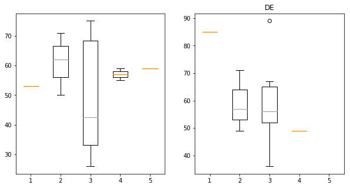

This is the code for the Lesson 5 Challenge.

Each question has a header, followed by a short description to answer that particular question.

```python
import pandas as pd
import numpy as np
import matplotlib.pyplot as plt
```


```python
df = pd.read_csv('Google Drive/Python/es.csv')
df2 = df.dropna()
df2.head(2)

```


<div>
<style scoped>
    .dataframe tbody tr th:only-of-type {
        vertical-align: middle;
    }

    .dataframe tbody tr th {
        vertical-align: top;
    }

    .dataframe thead th {
        text-align: right;
    }
</style>
<table border="1" class="dataframe">
  <thead>
    <tr style="text-align: right;">
      <th></th>
      <th>cntry</th>
      <th>idno</th>
      <th>year</th>
      <th>tvtot</th>
      <th>ppltrst</th>
      <th>pplfair</th>
      <th>pplhlp</th>
      <th>happy</th>
      <th>sclmeet</th>
      <th>sclact</th>
      <th>gndr</th>
      <th>agea</th>
      <th>partner</th>
    </tr>
  </thead>
  <tbody>
    <tr>
      <th>0</th>
      <td>CH</td>
      <td>5.0</td>
      <td>6</td>
      <td>3.0</td>
      <td>3.0</td>
      <td>10.0</td>
      <td>5.0</td>
      <td>8.0</td>
      <td>5.0</td>
      <td>4.0</td>
      <td>2.0</td>
      <td>60.0</td>
      <td>1.0</td>
    </tr>
    <tr>
      <th>1</th>
      <td>CH</td>
      <td>25.0</td>
      <td>6</td>
      <td>6.0</td>
      <td>5.0</td>
      <td>7.0</td>
      <td>5.0</td>
      <td>9.0</td>
      <td>3.0</td>
      <td>2.0</td>
      <td>2.0</td>
      <td>59.0</td>
      <td>1.0</td>
    </tr>
  </tbody>
</table>
</div>


```python
## df2012 = df2[df2['year'] == 6]
df2014 = df2[df2['year'] == 7]
```


```python
countries = np.unique(df2['cntry'])
```


```python
print(countries)
```

    ['CH' 'CZ' 'DE' 'ES' 'NO' 'SE']

# Question 1:

The results only really show up in ES and SE.

```python
for c in countries:
    plt.hist(df2012[df2012['cntry'] == c]['ppltrst'], alpha=.5, label='2012')
    plt.hist(df2014[df2014['cntry'] == c]['ppltrst'], alpha=.5, label='2014')
    plt.legend()
    plt.title(c)
    plt.show()
```


```python
import numpy as np 
import pylab 
import scipy.stats as stats

for c in countries:
    stats.probplot(df2012[df2012['cntry'] == c]['ppltrst'], dist="norm", plot=pylab)
    pylab.show()
```


```python
from scipy import stats
from sklearn.preprocessing import normalize

for c in countries:
    print(stats.ttest_ind(df2012[df2012['cntry'] == c]['ppltrst'], df2014[df2014['cntry'] == c]['ppltrst']))
#1 only difference in ES and SE
```

    Ttest_indResult(statistic=-0.7156974792217816, pvalue=0.4742916002909491)
    Ttest_indResult(statistic=0.34075433231518504, pvalue=0.7333479315909976)
    Ttest_indResult(statistic=-0.3466213170125284, pvalue=0.7317764273785732)
    Ttest_indResult(statistic=2.1000674443244907, pvalue=0.03583204193521363)
    Ttest_indResult(statistic=0.5119224181145228, pvalue=0.6087850218131978)
    Ttest_indResult(statistic=-2.0268698056063146, pvalue=0.0428293634522298)

# Question 2

There is no major difference between 2012 and 2014.

```python
import numpy as np 
import pylab 
import scipy.stats as stats

for c in countries:
    stats.probplot(df2012[df2012['cntry'] == c]['happy'], dist="norm", plot=pylab)
    pylab.show()
```


```python
print(stats.ttest_ind(df2012['happy'], df2014['happy']))
#2 no major difference
```

    Ttest_indResult(statistic=1.2074597686358974, pvalue=0.2272901912283969)


# Question 3

There does not appear to be any major difference between men and women in terms of TV watching.

```python
m2012 = df2012[df2012['gndr'] == 1]
f2012 = df2012[df2012['gndr'] == 2]
```


```python
plt.hist(m2012['tvtot'], alpha=.5, label='m')
plt.hist(f2012['tvtot'], alpha=.5, label='f')
plt.legend()
```


    <matplotlib.legend.Legend at 0x116f9d940>


```python
print(stats.ttest_ind(m2012['tvtot'], f2012['tvtot']))
#3 no major difference
```

    Ttest_indResult(statistic=-0.7323552192640558, pvalue=0.4639939646110154)

# Question 4

People who have partners seem to believe that others are more fair.


```python
single2012 = df2012[df2012['partner'] == 2]
partner2012 = df2012[df2012['partner'] == 1]
```


```python
plt.hist(single2012['pplfair'], alpha=.5, label='s')
plt.hist(partner2012['pplfair'], alpha=.5, label='p')
plt.legend()
```


    <matplotlib.legend.Legend at 0x110a58550>


```python
print(stats.ttest_ind(single2012['pplfair'], partner2012['pplfair']))
#4 yes partners think ppl are fair
```

    Ttest_indResult(statistic=-3.0430439318464235, pvalue=0.002356936676939248)


# Question 5

There does seem to be major differences.

CZ stands out.

```python
#'CH' 'CZ' 'DE' 'ES' 'NO' 'SE'

ch2014 = df2014[df2014['cntry'] == 'CH']
cz2014 = df2014[df2014['cntry'] == 'CZ']
de2014 = df2014[df2014['cntry'] == 'DE']
es2014 = df2014[df2014['cntry'] == 'ES']
no2014 = df2014[df2014['cntry'] == 'NO']
se2014 = df2014[df2014['cntry'] == 'SE']

plt.hist(ch2014['sclmeet'], alpha=.2, label='ch')
plt.hist(cz2014['sclmeet'], alpha=.2, label='cz')
plt.hist(de2014['sclmeet'], alpha=.2, label='de')
plt.hist(es2014['sclmeet'], alpha=.2, label='es')
plt.hist(no2014['sclmeet'], alpha=.2, label='no')
plt.hist(se2014['sclmeet'], alpha=.2, label='se')
plt.legend()
```


    <matplotlib.legend.Legend at 0x110e02128>


```python
stats.kruskal(
    ch2014['sclmeet'], cz2014['sclmeet'], de2014['sclmeet'], es2014['sclmeet'], no2014['sclmeet'], se2014['sclmeet'])
#no difference? not sure if it is that high.
```


# Question 6

The charts at the end show the difference. I think the major differences has to do with the number of people available for each group (which tends towards a bell curve).

    KruskalResult(statistic=185.2787643143486, pvalue=3.9883901965808886e-38)


```python
stats.f_oneway(ch2014['sclmeet'], cz2014['sclmeet'], de2014['sclmeet'], es2014['sclmeet'], no2014['sclmeet'], se2014['sclmeet'])
```


    F_onewayResult(statistic=38.31710615582137, pvalue=1.4886374222128358e-38)


```python
plt.hist(df2['agea'])
```


    (array([1.147e+03, 1.114e+03, 1.437e+03, 1.515e+03, 1.339e+03, 1.012e+03,
            4.600e+02, 1.160e+02, 6.000e+00, 1.000e+00]),
     array([ 15. ,  24.9,  34.8,  44.7,  54.6,  64.5,  74.4,  84.3,  94.2,
            104.1, 114. ]),
     <a list of 10 Patch objects>)


```python
for c in countries:
    df_t4 = df2014[df2014['cntry'] == c]
    df_t2 = df2012[df2012['cntry'] == c]
    
    data4 = list()
    data2 = list()
    fig = plt.figure(figsize=(10,5))
    ax1=fig.add_subplot(121)
    ax2=fig.add_subplot(122)
    for i in range(1,6):
        df4 = df_t4[df_t4['sclact'] == i]
        data4.append(df4['agea'])
        df2 = df_t2[df_t2['sclact'] == i]
        data2.append(df2['agea'])
    ax2.boxplot(data4)
    ax1.boxplot(data2)
    plt.title(c)
    plt.show()

        #plt.boxplot(df4['agea'], i)
    #plt.scatter(df_t4['agea'], df_t4['sclact'])
    #plt.scatter(df_t2['agea'], df_t2['sclact'])

```

    /usr/local/lib/python3.6/site-packages/numpy/core/fromnumeric.py:51: FutureWarning: reshape is deprecated and will raise in a subsequent release. Please use .values.reshape(...) instead
      return getattr(obj, method)(*args, **kwds)





```python
print(pl2012)
```

    (array([ 74., 122., 117., 109.,  69., 104., 107.,  90.,  55., 131., 138.,
           143.,  73., 145., 163., 142.,  75., 153., 156., 125.,  83., 145.,
           154., 141.,  64., 118., 135., 145.,  58.,  61., 139., 117.,  87.,
            49.,  76.,  32.,  54.,  21.,  29.,  25.,  20.,   0.,  14.,   6.,
             3.,   1.,   2.,   0.,   0.,   1.]), array([ 15.  ,  16.76,  18.52,  20.28,  22.04,  23.8 ,  25.56,  27.32,
            29.08,  30.84,  32.6 ,  34.36,  36.12,  37.88,  39.64,  41.4 ,
            43.16,  44.92,  46.68,  48.44,  50.2 ,  51.96,  53.72,  55.48,
            57.24,  59.  ,  60.76,  62.52,  64.28,  66.04,  67.8 ,  69.56,
            71.32,  73.08,  74.84,  76.6 ,  78.36,  80.12,  81.88,  83.64,
            85.4 ,  87.16,  88.92,  90.68,  92.44,  94.2 ,  95.96,  97.72,
            99.48, 101.24, 103.  ]), <a list of 50 Patch objects>)


```python
dif = pl2014 - pl2012
```


    ---------------------------------------------------------------------------

    TypeError                                 Traceback (most recent call last)

    <ipython-input-79-4e48d0cbad47> in <module>()
    ----> 1 dif = pl2014 - pl2012
    

    TypeError: unsupported operand type(s) for -: 'tuple' and 'tuple'


```python
def find_relative(df, k):
    age = list()
    sclact = list()
    for i in range(1, int(max(df['agea']))):
        area = df[(df['agea'] <= (i + k)) & (df['agea'] >= (i - k))]['sclact']
        #print(sum(area) / (len(area)))
        if (len(area) == 0):
            avg = 0
        else:
            avg = sum(area) / (len(area))
        if ((len(age) != 0) | ((avg != 0) & (len(age) == 0))):
            age.append(i)
            sclact.append(avg)
    return pd.DataFrame({'age': age, 'relative': sclact})
    

for c in countries:
    df_t4 = df2014[df2014['cntry'] == c]
    k = 15

    plt.figure(figsize=(10,5))
    result = find_relative(df_t4, k)
    result['change'] = result['relative'].diff()
#result.head(2)
    plt.plot(result['age'], result['change'])
    plt.title('Difference in socialization score for ' + c)
    plt.ylabel('average change in socialization')
    plt.xlabel('age +/- 15')
    plt.show()
```


